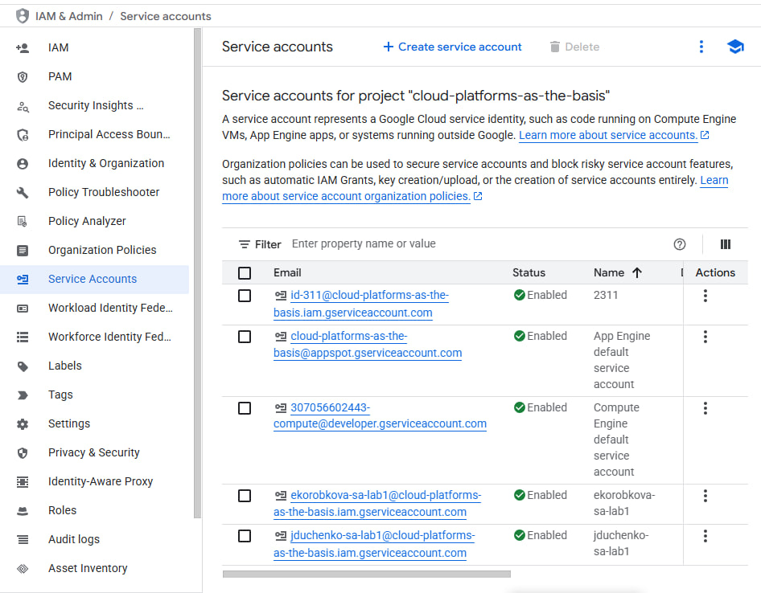
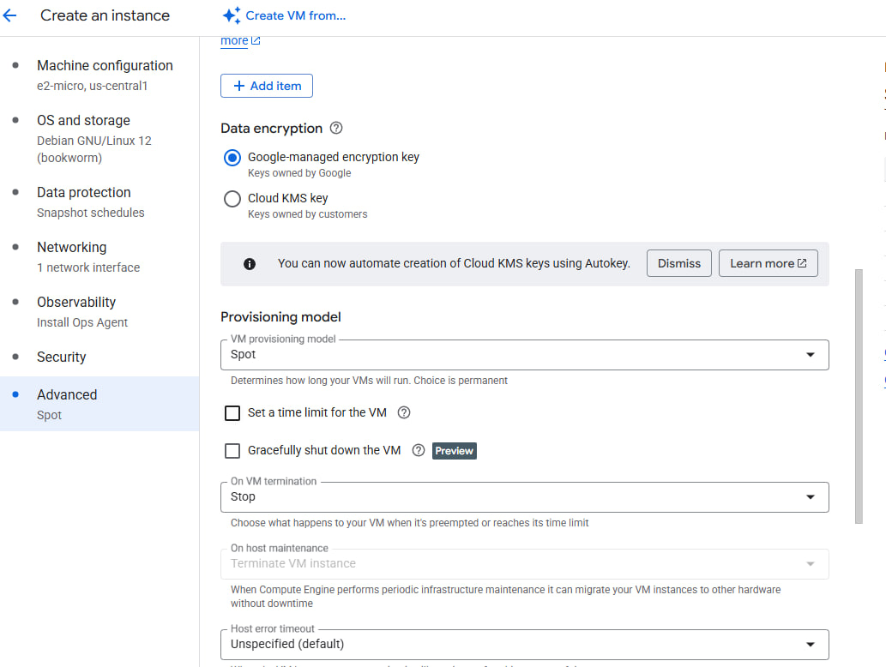
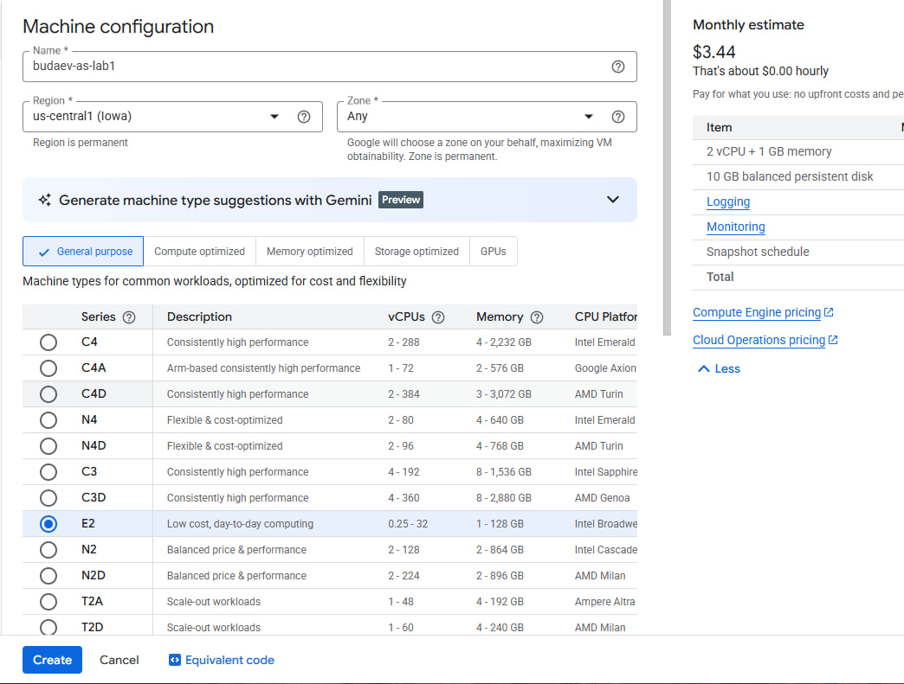
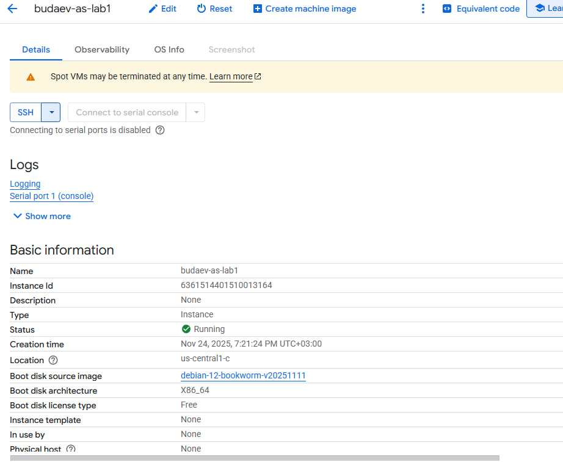
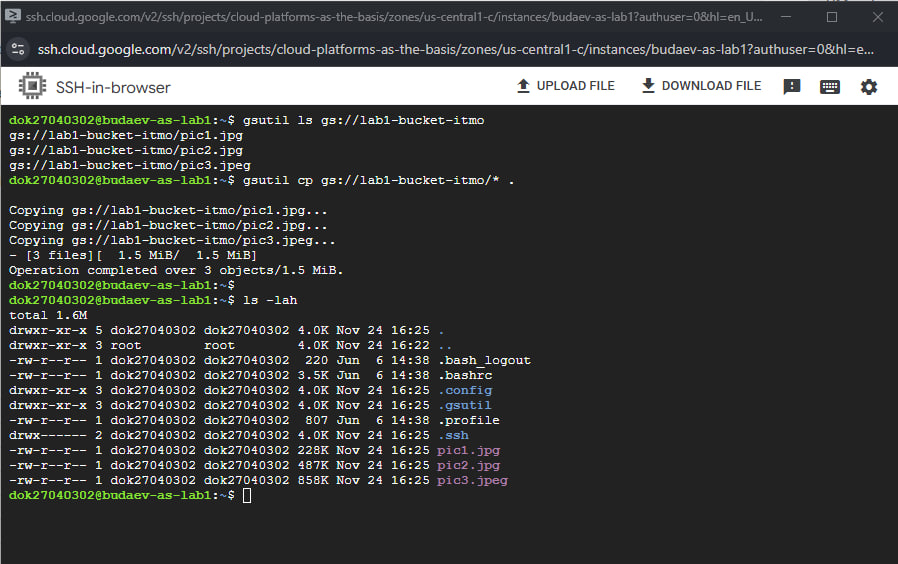
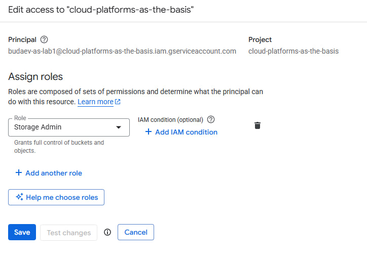
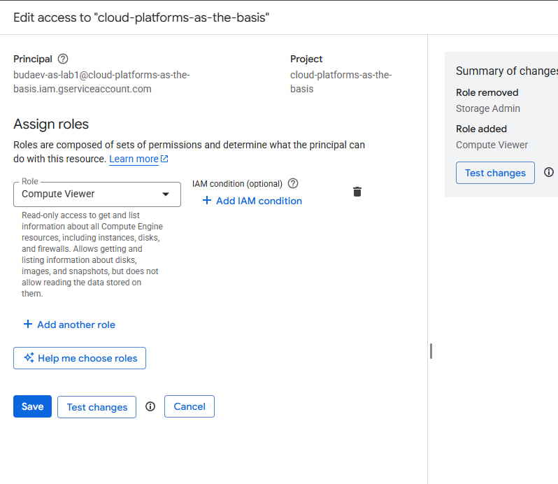
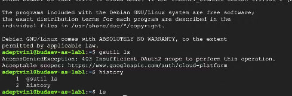

University: [ITMO University](https://itmo.ru/ru/)
Faculty: [FITM](https://ftmi.itmo.ru)
Course: [Cloud platforms as the basis of technology entrepreneurship](https://) ADD link
Year: 2025/2026
Group: U4225
Author: Budaev Alexandr Sayanovich
Lab: Lab1
Date of create: 24.11.2025
Date of finished: 24.11.2025

# Лабораторная работа №1  
**Тема:** Обзор Google Cloud и исследование основных сервисов  
**Цель:** Изучить основные сервисы Google Cloud и базовые операции: создание VM, работа с хранилищем, управление правами.

## Ход работы
1. Получил доступ к Google Cloud после заполнения формы.  
2. Создал Service Account `dstudent-sa-lab1` с ролью **Storage Admin**.  
3. Создал виртуальную машину `dstudent-vm-lab1` (e2-micro, Spot). 
  
4. Подключился к VM через SSH и с помощью `gsutil` скачал файлы:
5. Изменил роль Service Account на **Compute Viewer** и повторил копирование — доступ запрещён.      
6. Удалил VM и Service Account.

## Результаты
- Созданы и протестированы базовые ресурсы Google Cloud.  
- Выполнено копирование файлов с Cloud Storage.  
- Показано влияние изменения ролей на доступ.  
- Все созданные ресурсы удалены.

## Вывод
Google Cloud предоставляет удобные средства управления правами и ресурсами. Работа показала важность корректных IAM-ролей при использовании сервисов.
