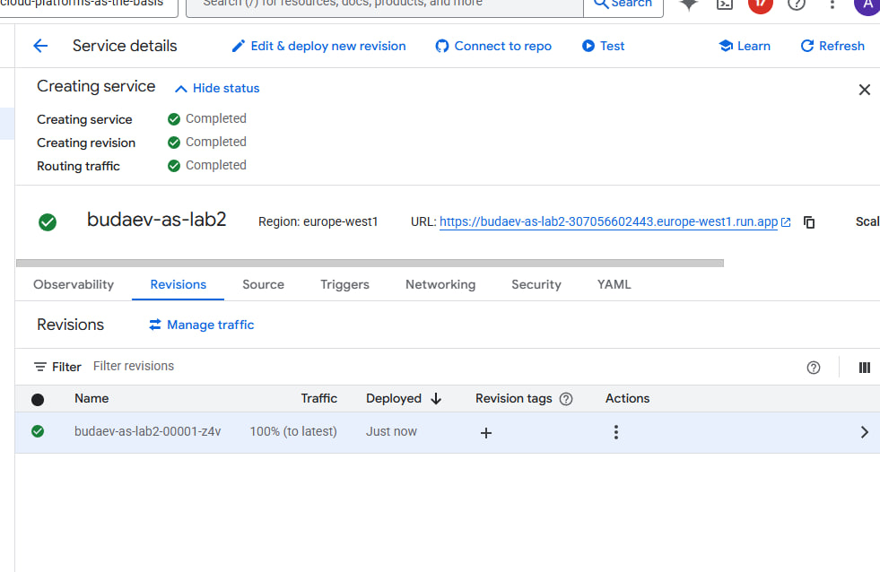
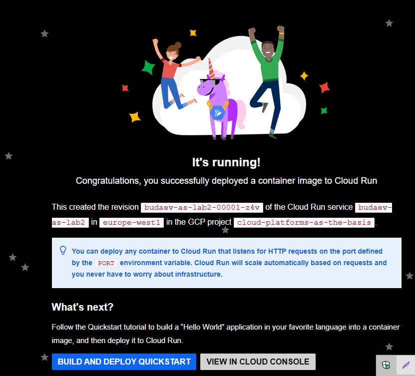
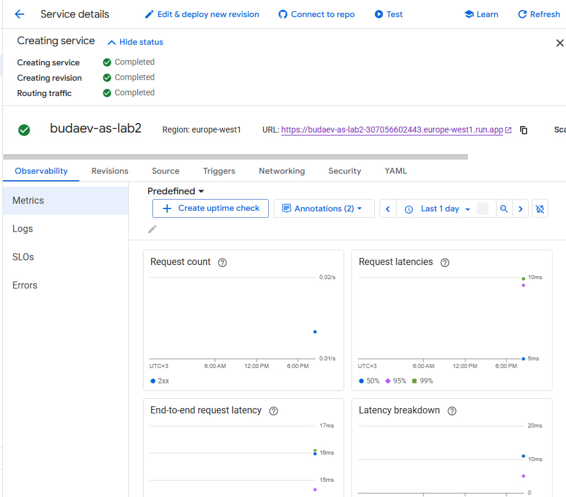
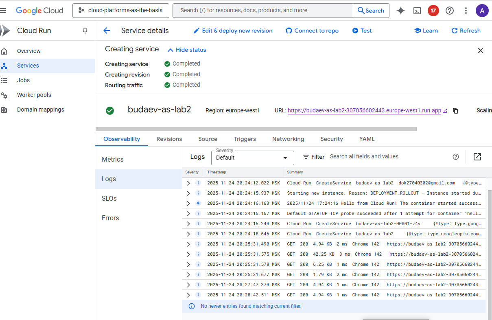
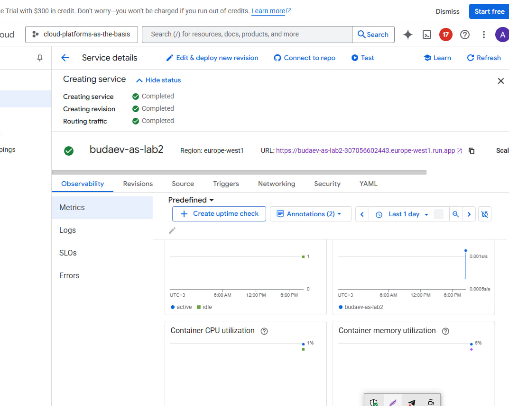
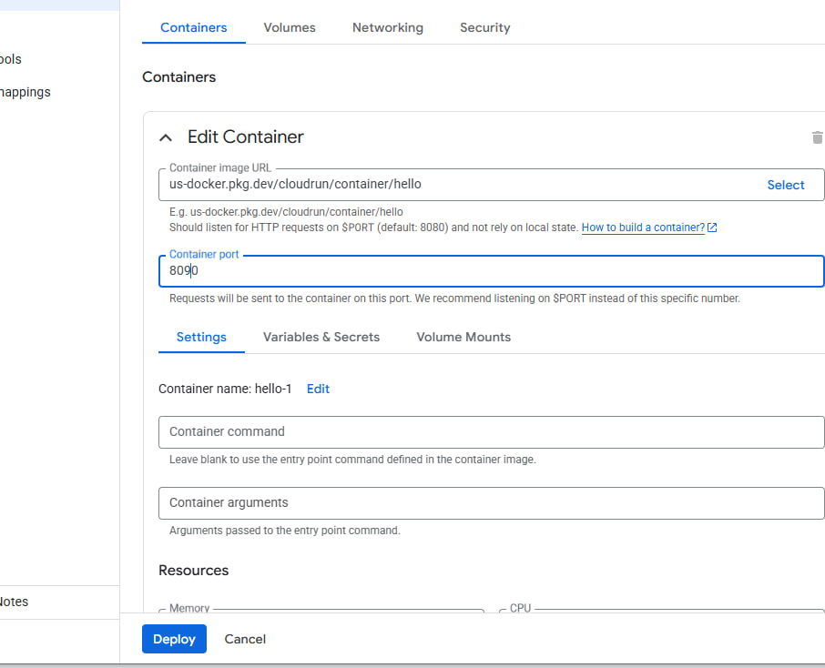

University: [ITMO University](https://itmo.ru/ru/)
Faculty: [FITM](https://ftmi.itmo.ru)
Course: [Cloud platforms as the basis of technology entrepreneurship](https://) ADD link
Year: 2025/2026
Group: U4225
Author: Budaev Alexandr Sayanovich
Lab: Lab2
Date of create: 25.11.2025
Date of finished: 25.11.2025

# Лабораторная работа №2  
**Тема:** Исследование Cloud Run  
**Цель:** Ознакомиться с работой сервиса Cloud Run, развернуть приложение, изменить конфигурацию и проанализировать логи и метрики.

## Ход работы
1. Создал новый сервис Cloud Run из дефолтного примера **Hello** (минимальные ресурсы).  
2. Перешёл по публичной ссылке Cloud Run и проверил работоспособность сервиса.  
3. Открыл разделы **Logs** и **Metrics**, проанализировал запросы, задержки и использование ресурсов.     
4. Изменил конфигурацию сервиса, сменив порт на **8090** — сервис перестал отвечать, так как контейнер слушал другой порт.   
5. Создал новую ревизию и переключал трафик между версиями, сравнил поведение и доступность.  
6. Удалил все созданные ресурсы Cloud Run.

## Результаты
- Развёрнут и протестирован сервис в Cloud Run.  
- Изучены логи и метрики работы контейнера.  
- Проверено влияние изменения порта и переключения трафика между ревизиями.  
- Все ресурсы корректно удалены.

## Вывод
Cloud Run позволяет быстро разворачивать контейнерные сервисы, предоставляет удобный доступ к логам, метрикам и управлению ревизиями. Изменения конфигурации (например, порта) напрямую влияют на работоспособность сервиса.
****