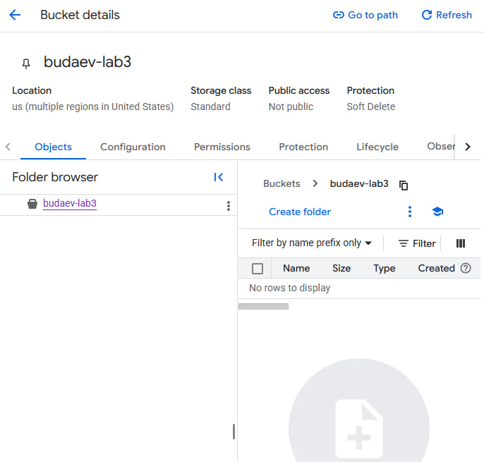
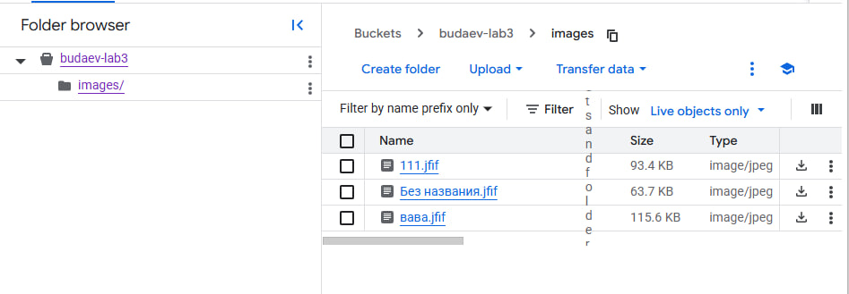
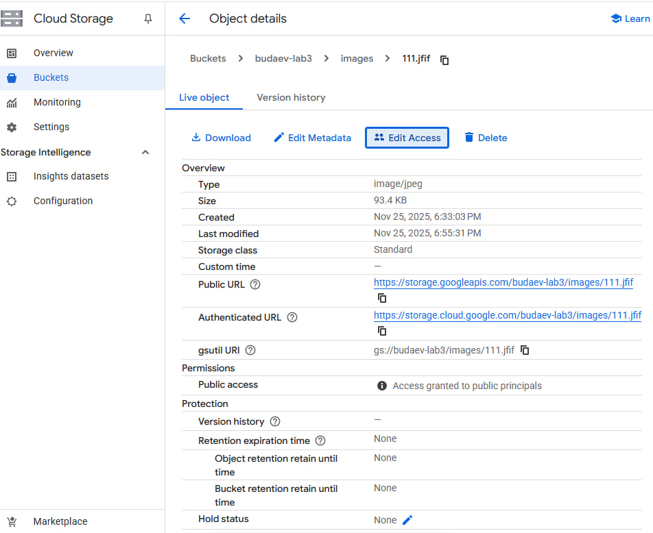

University: [ITMO University](https://itmo.ru/ru/)
Faculty: [FITM](https://ftmi.itmo.ru)
Course: [Cloud platforms as the basis of technology entrepreneurship](https://) ADD link
Year: 2025/2026
Group: U4225
Author: Budaev Alexandr Sayanovich
Lab: Lab3
Date of create: 25.11.2025
Date of finished: 25.11.2025

# Лабораторная работа №3  
## Исследование Cloud Storage

### **Цель работы**
Ознакомиться с основными понятиями облачных хранилищ, изучить модели хранения данных (блочное, файловое, объектное), а также освоить базовые операции в Google Cloud Storage: создание бакета, загрузку объектов, управление доступами и получение публичных ссылок.

---

## **Ход работы**

### **1. Выбор проекта**
В Google Cloud Console выбран проект:

Проект содержит права для работы с Cloud Storage.

---

### **2. Создание Cloud Storage bucket**
1. Открыто меню: **Cloud Storage → Buckets**  
2. Нажата кнопка **Create bucket**  
3. Параметры:
   - Name: `budaev-lab3`
   - Location type: Multi-region
   - Location: us
   - Storage class: Standard
   - Access control: Uniform (позже переключено на fine-grained)

Бакет успешно создан.

---

### **3. Загрузка изображений**
В корень бакета загружены 3 изображения с помощью кнопки **Upload files**.

---

### **4. Создание папки и перемещение файлов**
1. Создана папка `images`  
2. Все загруженные файлы перемещены в неё с помощью **Move**

---

### **5. Настройка публичного доступа**
1. В настройках бакета выполнено:
   - Снята защита Public Access Prevention  
   - Переключено управление доступом на **Fine-grained ACL**

2. Для каждого файла:
   - Открыто меню **Edit Access**
   - В Entity выбран тип **Public**
   - Назначена роль **Reader**
   - Изменения сохранены

Теперь объекты доступны публично.

---

### **6. Получение публичных ссылок**
Для каждого файла получен Public URL вида:

Ссылки успешно открываются в браузере.

https://storage.googleapis.com/budaev-lab3/images/111.jfif
---

### **7. Удаление ресурсов**
После выполнения лабораторной работы:
- Папка `images` и объекты оставлены для отчёта  
- При необходимости весь бакет может быть удалён через **Delete bucket**

---

## **Результаты**
В ходе работы были выполнены:
- создание бакета Cloud Storage  
- загрузка и организация файлов  
- настройка object-level ACL  
- предоставление публичного доступа  
- получение ссылок на объекты  

---

## **Вывод**
Google Cloud Storage предоставляет удобные средства для работы с объектами, гибкое управление доступами и простую систему публикации данных. Лабораторная работа показала различия между Uniform и Fine-grained ACL, а также продемонстрировала полный цикл работы с объектным хранилищем.
