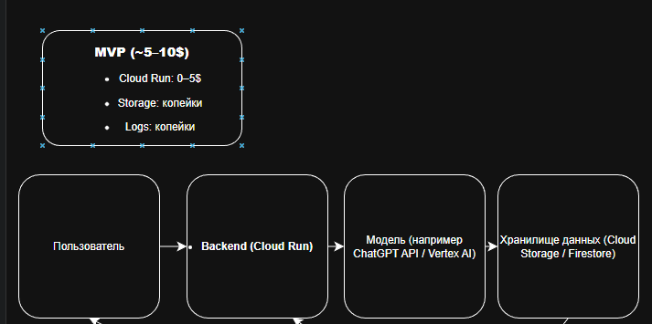
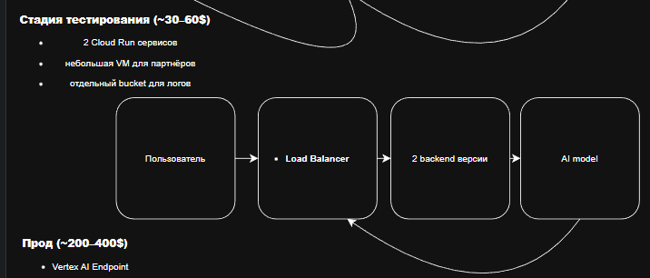

University: [ITMO University](https://itmo.ru/ru/)
Faculty: [FITM](https://ftmi.itmo.ru)
Course: [Cloud platforms as the basis of technology entrepreneurship](https://) ADD link
Year: 2025/2026
Group: U4225
Author: Budaev Alexandr Sayanovich
Lab: Lab4
Date of create: 25.11.2025
Date of finished: 25.11.2025

# Лабораторная работа №4  
## Разработка инфраструктуры MVP AI-приложения

### **Цель работы**
Изучить подход к проектированию инфраструктуры AI-приложений, разработать архитектуру для трёх стадий развития продукта (MVP, тестирование партнёров, продовая версия), оценить стоимость использования облачных ресурсов и обосновать выбор технологий.

---

## **Описание приложения**
Рассматривается простое AI-приложение — чат-бот/LLM-ассистент, отвечающий на пользовательские запросы. Приложение включает backend-часть, хранилище данных и сервис для выполнения AI-инференса.

---

## **Этап 1 — MVP архитектура**
Минимально необходимая инфраструктура:

- **Cloud Run** — backend API  
- **AI-модель** (через Vertex AI API или внешний API)  
- **Cloud Storage / Firestore** — хранение контекста/истории  
- **Cloud Logging** — базовые логи  

Основная цель — минимальные затраты, быстрый запуск и отсутствие необходимости в администрировании серверов.

---

## **Этап 2 — Архитектура для тестирования партнёрами**
Расширенная инфраструктура:

- **Отдельный backend (staging)** для партнёров  
- **Autoscaling** для Cloud Run  
- **Отдельный bucket для логов и аналитики**  
- **Контроль доступа и IAM-роли**  
- **Версионность моделей / конфигураций backend-сервисов**  

Позволяет протестировать нагрузку, отделить партнёрский трафик от боевого, собирать метрики и подготовиться к увеличению аудитории.

---

## **Этап 3 — Продовая архитектура**
Полноценная продуктивная инфраструктура:

- **Vertex AI Endpoint или GPU-VM** — выделенный сервис для инференса  
- **Load Balancer** — распределение трафика  
- **VPC** — внутренняя сеть и безопасность  
- **Cloud Monitoring + Alerts** — мониторинг SLA  
- **Разделённые buckets:**  
  - data  
  - logs  
  - backups  
- **Autoscaling & Failover**  

Обеспечивает надёжность, масштабируемость, предсказуемость задержек и стабильность работы под нагрузкой.

---

## **Экономическая модель (оценка затрат)**

### **MVP (~5–10$/мес)**
- Cloud Run (минимальная загрузка): 0–5$  
- Cloud Storage: <1$  
- Logs/Monitoring: <1$  

Итого: **~5–10$**

### **Тестирование (~30–60$/мес)**
- Два Cloud Run инстанса + autoscaling: 10–20$  
- Отдельные buckets: <1$  
- Небольшая VM для тестового инференса: 20–40$  

Итого: **~30–60$**

### **Прод (~200–400$/мес)**
- Vertex AI Endpoint / GPU VM: 150–300$  
- Load Balancer: 15–20$  
- Monitoring + Logging: 10–20$  
- Storage: 1–5$  

Итого: **~200–400$**

---

## **Обоснование выбора ресурсов**
- **Serverless-подход на MVP** — минимальные затраты и отсутствие DevOps.  
- **Авто-масштабирование на стадии тестирования** — партнёры могут давать всплески нагрузки.  
- **Отдельный inference-endpoint на проде** — стабильность, скорость и SLA.  
- **Разделение хранилищ** — безопасность и структурированность данных.  
- **Мониторинг и балансировка** — требование к стабильности продового продукта.  

---

## **Вывод**
Разработана инфраструктура AI-приложения для трёх стадий развития — от минимального MVP до продовой версии. Построены архитектуры, сформирована экономическая модель и выполнено обоснование выбора облачных сервисов.
